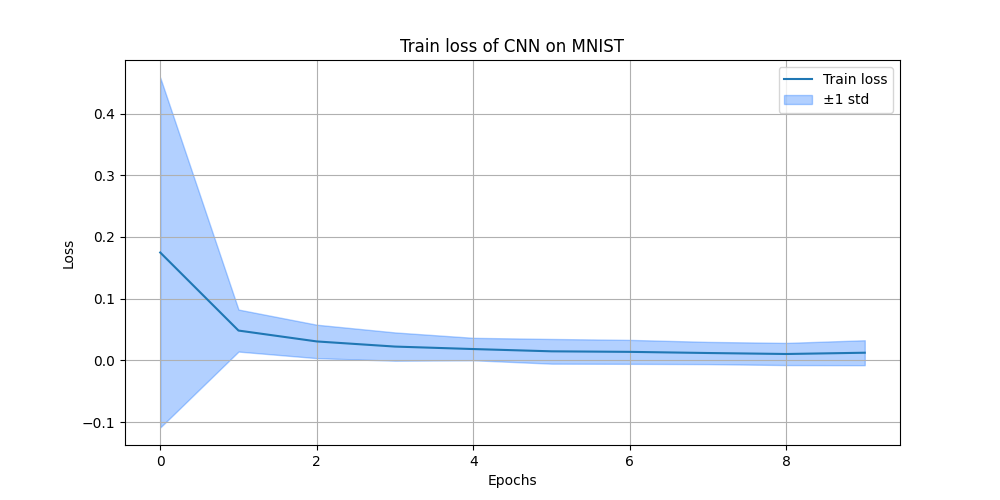
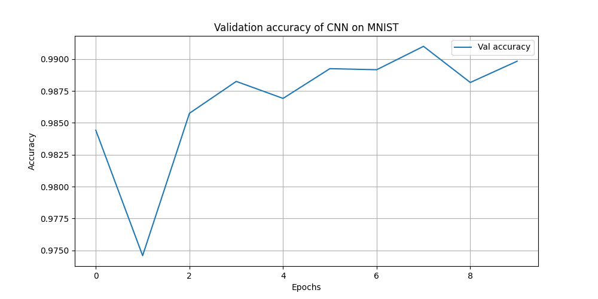
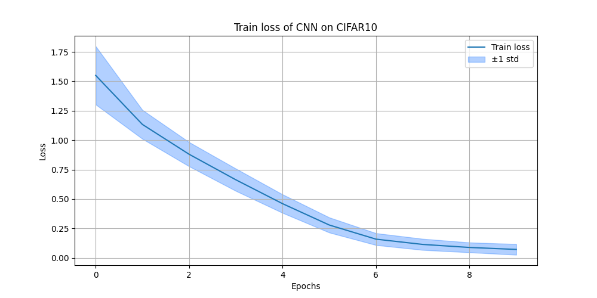
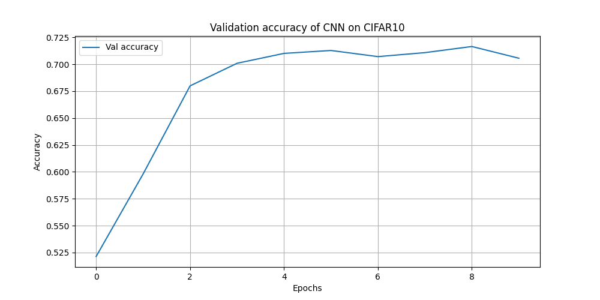
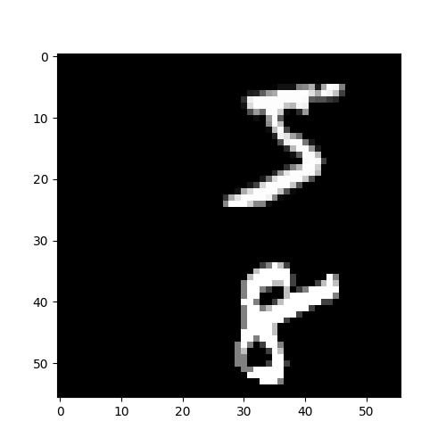
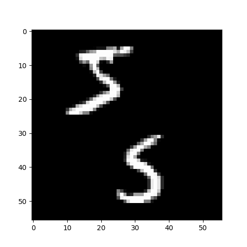
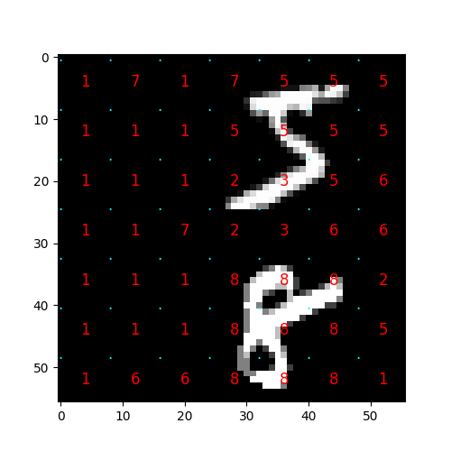
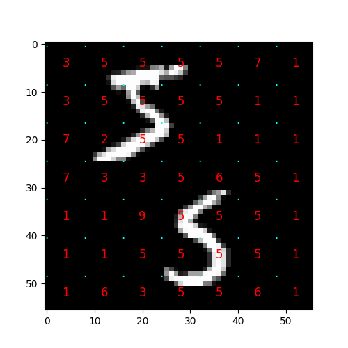
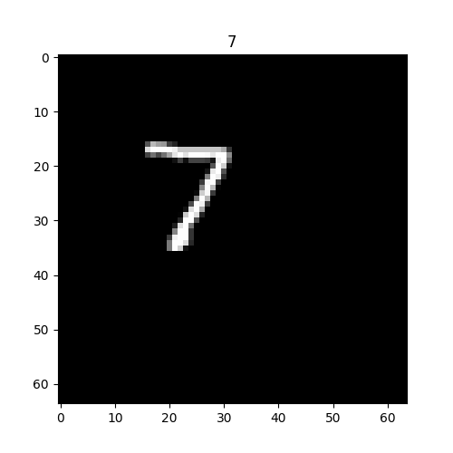

 # Lab 1: CNNs
 During this laboratory session we conducted some experiments on Convolutional Neural Networks.

## Experiment 1
The first experiment is a comparison of the accuracy between a "simple" MLP, a "complex" MLP and a CNN on MNIST and CIFAR10.

The code is in `Lab1_exercise1.py`.

The "simple" MLP is a Multi-Layer Perceptron with 2 hidden layers.

The "complex" MLP is just a MLP with 4 hidden layers.

The CNN has 4 convolutional layers and the classification head is made by just 2 fully connected layers with a non-linear function in between.

These models are implemented in `models.py`.

The models' settings (namely the input size / channel number and classification head input size) changes between the two datasets.

We trained each model for 10 epochs with a batch size of 128. The optimizer we used is AdamW with a learning rate of 1e-3.

### Results
We collected the train losses, the validation accuracies and the test accuracies (after the 10 epochs of training).

#### MNIST

Looking at this graphs it is possible to see that the CNN reaches faster lower loss values.

The convolutional model scores higher accuracy values with respect to the MLPs.

#### CIFAR 10

While on MNIST the MLPs manage to obtain low loss values (because the dataset is very simple to learn), on CIFAR 10 only the CNN is capable of having a "good" value of the loss function.

Also from these plots we can see that the CNN performs much better than the MLPs (the CNN scores almost 20 points more than the non-convolutional models).

#### Test accuracY
| Model       | MNIST    | CIFAR 10 |
|-------------|----------|----------|
| Basic MLP   | 0.98     | 0.53     |
| Complex MLP | 0.98     | 0.53     |
| CNN         | **0.99** | **0.69** |

This table confirms what the previous sections say: the CNN is incredible better than MLPs at classifying images!

Another notable thing is that increasing the number of hidden layers in the MLP does not bring any sensible increment in the performance of the model.

## Experiment 2
The second experiment we conducted consists in training a Fully Convolutional Neural Network and see how it classifies samples from a "modified" MNIST. The code is in `Lab1_exercise2.py`.

These samples are just 56x56 images of two MNIST numbers. The code we used to make this dataset is in `modifiedMNIST.py`.
In the picture below it is showed two samples from this dataset.
|  |  |
|:----:|:----:|

The model we use is a Fully Convolutional Neural Network (defined in `models.py`) with only 4 convolutional layers. Each layer but the last is followed by the activation function and by max pooling.

The optimizer we used is AdamW with a learning rate of 1e-3. We used a batch size of 256.

We found that it is very important to use a random translation augmentation to make the model learn to predict the correct number even when it is not right in the center of the image (like in the standard MNIST).

We trained the model for 30 epochs.

The model is made in such a way that splits the image in patches and for each one it predicts the label the patch belongs to.

This way to do the prediction has an obvious drawback: its accuracy results very low because the model predicts a label even for "empty" patches.

However, if we look at how the predictions are distributed over the image we can see that near the numbers the predictions are correct. We think that a behaviour like that is an indicator of the correctness of the method.
 

## Experiment 3
In this third experiment we studied the performance of a CNN that does not depend on the input size.
The code is in `Lab1_exercise2_non_size_dependent_cnn.py`.

The model can be found in `models.py` and its structure is:
- 3 convolutional layers
- global average pooling
- classification head (a fully connected layer)

We trained this model on MNIST for 10 epochs, with a batch size of 256 and with AdamW (learning rate = 1e-3).

As for experiment 2 we used a random translation augmentation to get shifted samples.

We tested the model on a version of MNIST we made where the images are 64x64 and the content is just a shifted sample from MNIST.

The test dataset is the shifted version of the test dataset of MNIST.

The model (trained on the standard MNIST) scored an accuracy of 0.97 on the test dataset.

This result is obtained with a translate parameter of 0.4.

We found that with weaker augmentations the model has an accuracy drop with larger test images. It is also very likely that with stronger translations the model works very well also with larger images.

We think that the cause of this problem is that, with a weak translation, the model has not seen the number it must predict too far from the center and so it does not work when the image is big (and the number will likely be off-center).

