# Lab 3: Reinforcement Learning
In this laboratory session we studied and conducted some experiments on Reinforcement Learning techinques.
We focused on REINFORCE algorithm, on Deep Q Learning and on using PPO to solve more complex environments.

The environment we used are the ones from [Gymnasium](https://gymnasium.farama.org/).


## Experiment 1
In the first experiment we implemented a basic version of the REINFORCE algorithm and used it to make an agent solve the Cartpole environment.

The code is in `basic_reinforce.py`.

REINFORCE is an algorithm that iteratively gives to a Policy Net an observation of the environment, that net returns the agent's next action, the agent performs that action in the environment and we get the reward back.

The Policy Net, in this case, is a very simple neural network:

```
class PolicyNet(nn.Module):
    def __init__(self, env):
        super().__init__()
        self.fc1 = nn.Linear(env.observation_space.shape[0], 16)
        self.fc2 = nn.Linear(16, env.action_space.n)
        self.relu = nn.ReLU()
        
    def forward(self, s):
        s = F.relu(self.fc1(s))
        s = F.softmax(self.fc2(s), dim=-1)
        return s
```

We measured the average reward / average episode length (in this environment they are the same thing) and the running reward.
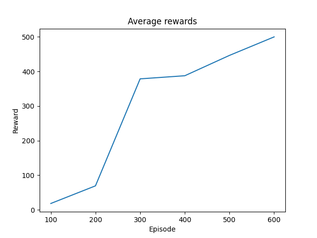 | 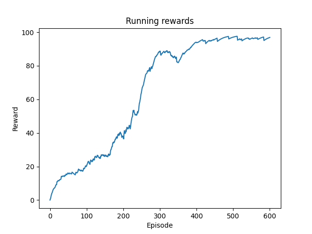
|--|--|

From these plots it is possible to see that the agent succeeds in solving the environemnt (after all it's a very simple one) after 600 episodes.

## Experiment 2
Then we implemented a version of REINFORCE with the value baseline in order to stabilize and speed-up convergence.

The code is in `value_baseline_reinforce.py`.

We used a Value Net (a deep neural network with the same architecture of the Policy Net) to get $\tilde{v}(s)$, the estimation of the state-value function $v(s)$.

```
class ValueNet(nn.Module):
    def __init__(self, env):
        super().__init__()
        self.fc1 = nn.Linear(env.observation_space.shape[0], 16)
        self.fc2 = nn.Linear(16, 1)
        self.relu = nn.ReLU()
        
    def forward(self, s):
        s = F.relu(self.fc1(s))
        s = self.fc2(s)
        return s
```
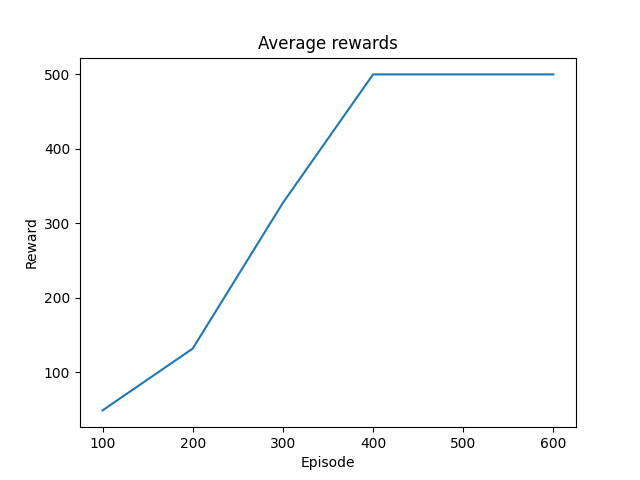 | 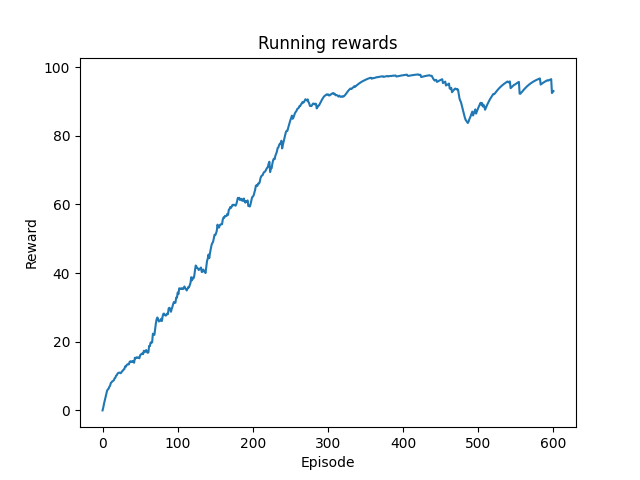
|--|--|

The plots show that the agent, when using the algorithm with the value baseline, learns how to solve the environment much faster than with the basic version of the algorithm. 

## Experiment 3
As our third experiment we _tried_ to train an agent to be able to solve the LunarLander environment. We used REINFORCE with Value Baseline but we did not succeed in doing so.

The code is in `lunar_lander_reinforce.py`.

We ran this experiment **a lot** of times hoping it was a problem of weight initialization but all of our training went like the one showed in these graphs.
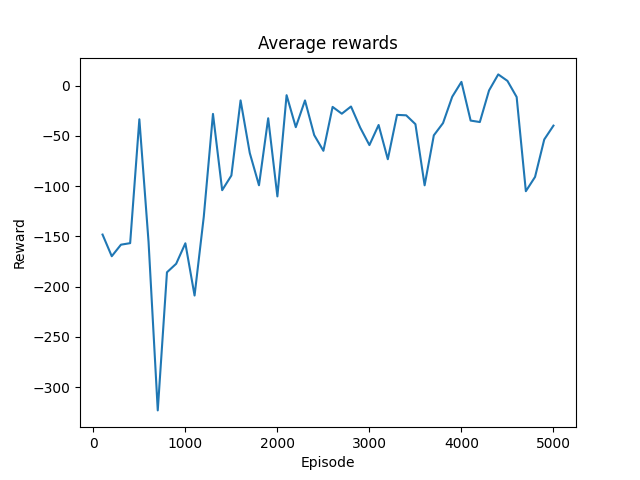 | 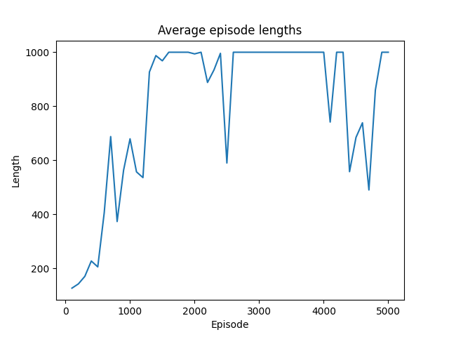
|--|--|

As these plots show, we ran 5000 episodes but the training was very noisy and it did not converge.

Our hypotesis about this failure is that the REINFORCE algorithm is not strong enough to make the agent learn how to solve the environment.
For this reason we tried to solve that environment with a more powerful technique in [Experiment 4](#experiment-4).

Here there is a GIF of our agent trying to land correctly:
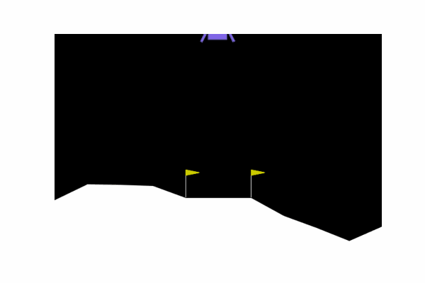

## Experiment 4
In this experiment we used Deep Q Learning to solve both Cartpole and LunarLander.

The code is in `deep_q_learning_cartpole.py` and in `deep_q_learning_lunar_lander.py`.

The Deep Q Network we used is the following:
```
class DQN(nn.Module):
    def __init__(self, env):
        super(DQN, self).__init__()
        self.fc1 = nn.Linear(env.observation_space.shape[0], 128)
        self.fc2 = nn.Linear(128, 128)
        self.fc3 = nn.Linear(128, env.action_space.n)
    
    def forward(self, x):
        x = F.relu(self.fc1(x))
        x = F.relu(self.fc2(x))
        return self.fc3(x)
```
This network architecture is used by both the policy network and the target network.
The difference between these two networks is that the target one is updated in the following way:
$$\theta_t \leftarrow \tau \cdot \theta_p + (1-\tau)\cdot\theta_t$$
with $\theta_p$ the parameters of the policy network, $\theta_t$ the parameters of the target network and $\tau \in (0,1)$.

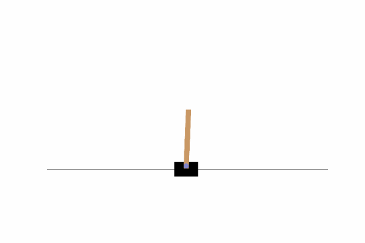 | 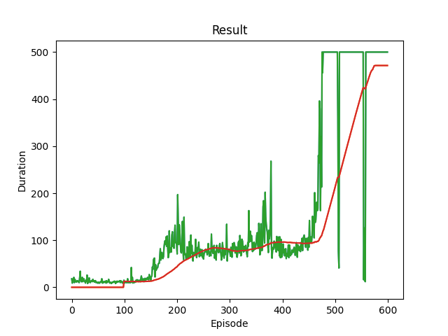
|--|--|
|A GIF of the agent correctly solving the environemnt. | The green curve is the episode reward / length(remember that for Cartpole they are equivalent).<br>The red curve is the average episode reward over the previous 100 episodes.|

As illustrated by this graph, the training is much more stable and from the epoch 470 (more or less) the agent scores consistently 500 points.

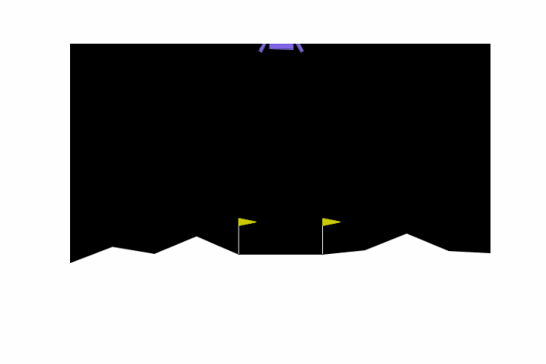 | 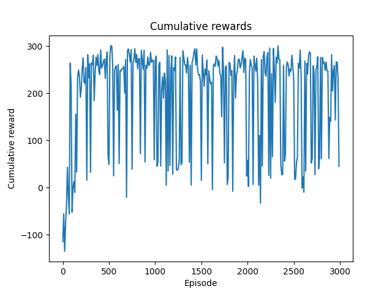
|--|--|
|A GIF of the agent correctly solving the environemnt. | Cumulative reward measured every 10 episodes.|

The training, as shown by this plot, is really successful and the agent can finally land safely.

## Experiment 5
After the success in LunarLander we trained an agent to solve the CarRacing environment.

We used the PPO algorithm from Stable Baselines 3.

We trained the model for 3M timesteps and we used the vectorized environemnts to improve training.

The code is in `CarRace_multiproc.py`.


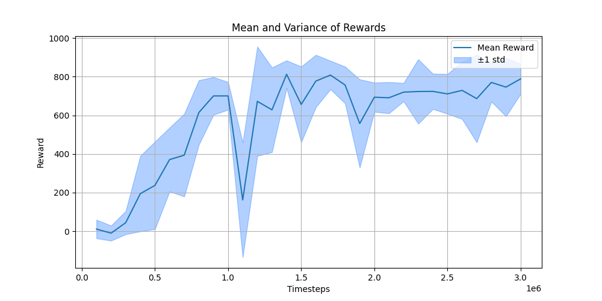
This graph shows that starting from the 1M-th timestep there are almost no increments in the reward, hence the training could have been stopped at least 1.5M timestep earlier.


This GIF shows the agent driving the car in the CarRacing environment.

## Bonus

Since we found very interesting training the agents to play little games we tried to train an agent able to play Frogger.

We used the same setup we used for the CarRacing environment: PPO, 3M timesteps and vectorized environments.
We used the RGB observation space.

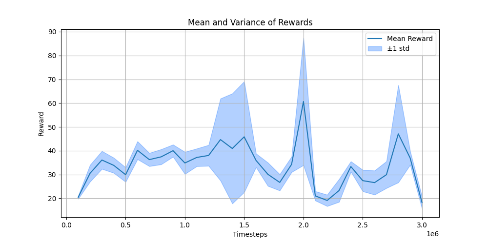

The mean reward is quite bouncy and the agent does not learn how to complete the game. 
However, it still manages to reach the end of the pond once.

<source src="../images/lab3/Ex6/ppo_froggers_3000000.gif" alt="Frogger" width="480" height="630">
